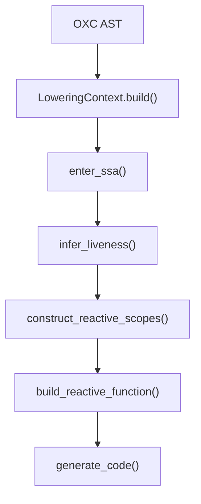

# React Compiler: Rust vs TypeScript Parity Analysis

> **Last Updated:** February 2026
> **Rust Compiler:** `react-compiler-rust/src/` (~3,500 LOC across 14 files)
> **TS Compiler:** `babel-plugin-react-compiler/src/` (~130 files across 13 modules)

---

## Overall Parity Score

| Area | Rust Status | Parity |
|------|------------|--------|
| **Parsing** | ✅ OXC parser | ✅ Full (different parser, same result) |
| **AST → HIR Lowering** | ⚠️ Partial | ~35% |
| **SSA Transformation** | ✅ Implemented | ~70% |
| **Inference / Analysis** | ⚠️ Liveness only | ~10% |
| **Optimization Passes** | ❌ Missing | 0% |
| **Reactive Scopes** | ⚠️ Basic | ~25% |
| **Validation Passes** | ❌ Missing | 0% |
| **Transform Passes** | ❌ Missing | 0% |
| **Reactive Function (Tree)** | ⚠️ Basic | ~30% |
| **Code Generation** | ⚠️ Basic | ~20% |
| **Configuration / Environment** | ❌ Missing | 0% |
| **Babel Integration** | N/A (uses NAPI) | N/A |
| **Estimated Overall** | | **~15%** |

---

## Pipeline Comparison

### TS Compiler Pipeline (~55 passes)

```mermaid
graph TD
    A[Babel AST] --> B["lower()"]
    B --> C["pruneMaybeThrows"]
    C --> D["validateContextVariableLValues"]
    D --> E["validateUseMemo"]
    E --> F["dropManualMemoization"]
    F --> G["inlineIIFEs"]
    G --> H["mergeConsecutiveBlocks"]
    H --> I["enterSSA"]
    I --> J["eliminateRedundantPhi"]
    J --> K["constantPropagation"]
    K --> L["inferTypes"]
    L --> M["Validations: hooks, capitalized calls"]
    M --> N["transformFire"]
    N --> O["lowerContextAccess"]
    O --> P["optimizePropsMethodCalls"]
    P --> Q["analyseFunctions"]
    Q --> R["inferMutationAliasingEffects"]
    R --> S["deadCodeElimination"]
    S --> T["instructionReordering"]
    T --> U["inferMutationAliasingRanges"]
    U --> V["More Validations"]
    V --> W["inferReactivePlaces"]
    W --> X["rewriteInstructionKinds"]
    X --> Y["inferReactiveScopeVariables"]
    Y --> Z["Scope alignment & merging"]
    Z --> AA["buildReactiveScopeTerminals"]
    AA --> AB["flattenReactiveLoops"]
    AB --> AC["propagateScopeDependencies"]
    AC --> AD["buildReactiveFunction"]
    AD --> AE["Reactive pruning passes"]
    AE --> AF["codegenFunction"]
```



### Rust Compiler Pipeline (5 phases)



---

## Detailed Feature Comparison

### 1. AST → HIR Lowering

| Feature | TS (`BuildHIR.ts` — 143KB) | Rust (`lowering.rs` — 36KB) | Status |
|---------|---------------------------|----------------------------|--------|
| Function declarations | ✅ | ✅ | ✅ Parity |
| Arrow functions | ✅ | ❌ | ❌ Missing |
| Function expressions | ✅ | ❌ | ❌ Missing |
| Variable declarations (let/const/var) | ✅ | ✅ | ✅ Parity |
| If/else statements | ✅ | ✅ | ✅ Parity |
| While loops | ✅ | ✅ | ✅ Parity |
| For loops | ✅ | ✅ | ✅ Parity |
| For-in loops | ✅ | ❌ | ❌ Missing |
| For-of loops | ✅ | ❌ | ❌ Missing |
| Switch statements | ✅ | ✅ | ✅ Parity |
| Try-catch-finally | ✅ | ❌ | ❌ Missing |
| Break / Continue | ✅ | ✅ | ✅ Parity |
| Labeled statements | ✅ | ❌ | ❌ Missing |
| Return statements | ✅ | ✅ | ✅ Parity |
| Throw statements | ✅ | ❌ | ❌ Missing |
| Binary expressions | ✅ All operators | ✅ All operators | ✅ Parity |
| Unary expressions | ✅ All operators | ✅ All operators | ✅ Parity |
| Update expressions (++/--) | ✅ | ✅ | ✅ Parity |
| Assignment expressions | ✅ All forms | ⚠️ Basic + compound | ⚠️ Partial |
| Logical expressions (&&, \|\|, ??) | ✅ | ✅ (&&, \|\|, ??) | ✅ Parity |
| Conditional (ternary) expressions | ✅ | ❌ | ❌ Missing |
| Call expressions | ✅ | ✅ | ✅ Parity |
| Member expressions (a.b) | ✅ | ✅ | ✅ Parity |
| Computed member (a[b]) | ✅ | ✅ | ✅ Parity |
| Optional chaining (?.) | ✅ | ❌ | ❌ Missing |
| Template literals | ✅ | ❌ | ❌ Missing |
| Tagged templates | ✅ | ❌ | ❌ Missing |
| Object literals | ✅ Full | ✅ Basic | ⚠️ Partial |
| Array literals | ✅ Full | ✅ Basic | ⚠️ Partial |
| Spread in calls/arrays/objects | ✅ | ⚠️ Partial | ⚠️ Partial |
| Destructuring (basic) | ✅ | ✅ | ✅ Parity |
| Destructuring (nested) | ✅ | ❌ | ❌ Missing |
| Destructuring (defaults) | ✅ | ❌ | ❌ Missing |
| Rest patterns | ✅ | ❌ | ❌ Missing |
| New expressions | ✅ | ❌ | ❌ Missing |
| Sequence expressions | ✅ | ❌ | ❌ Missing |
| Await expressions | ✅ | ❌ | ❌ Missing |
| Yield expressions | ✅ | ❌ | ❌ Missing |
| Class declarations | ✅ | ❌ | ❌ Missing |
| JSX elements | ✅ Full JSX support | ❌ | ❌ Missing |
| TypeScript annotations | ✅ | ❌ Stripped by parser | ⚠️ N/A |
| Context identifiers | ✅ `FindContextIdentifiers` | ❌ | ❌ Missing |

---

### 2. HIR Data Model

| Feature | TS (`HIR.ts` — 52KB) | Rust (`hir.rs` — 7KB) | Status |
|---------|----------------------|----------------------|--------|
| BlockId, InstrId | ✅ | ✅ | ✅ Parity |
| HIRFunction (name, params, blocks) | ✅ | ✅ | ✅ Parity |
| BasicBlock (instructions, terminal, preds) | ✅ | ✅ | ✅ Parity |
| Place (identifier + effect) | ✅ Effect tracking | ⚠️ No effect | ⚠️ Partial |
| Identifier (name, id, scope, type, etc.) | ✅ Rich metadata | ⚠️ name + id only | ⚠️ Partial |
| Mutable ranges on identifiers | ✅ | ❌ | ❌ Missing |
| Reactive scope on identifiers | ✅ | ❌ (on Instruction only) | ⚠️ Partial |
| InstructionKind (Const, Let, Reassign, etc.) | ✅ | ❌ | ❌ Missing |
| Instruction effects/aliasing | ✅ | ❌ | ❌ Missing |
| Terminal types | ✅ 15+ types | ⚠️ 4 types (Goto, If, Return, Switch) | ⚠️ Partial |
| Missing terminals | N/A | ❌ DoWhile, For, ForIn, ForOf, Try, Throw, Label, Scope, etc. | ❌ Missing |
| Phi nodes | ✅ | ✅ | ✅ Parity |
| Environment / Config | ✅ Full config system (44KB) | ❌ | ❌ Missing |
| ObjectShape / Globals | ✅ 74KB combined | ❌ | ❌ Missing |
| Type system | ✅ TypeSchema (9KB) | ❌ | ❌ Missing |

---

### 3. SSA Transformation

| Feature | TS (`SSA/`) | Rust (`ssa.rs` — 12KB) | Status |
|---------|------------|----------------------|--------|
| Enter SSA (phi insertion + renaming) | ✅ `EnterSSA.ts` (9KB) | ✅ `enter_ssa()` | ✅ Parity |
| Dominator tree computation | ✅ `Dominator.ts` | ✅ `dominators.rs` | ✅ Parity |
| Eliminate redundant phi | ✅ `EliminateRedundantPhi.ts` | ❌ | ❌ Missing |
| Rewrite instruction kinds | ✅ `RewriteInstructionKinds` | ❌ | ❌ Missing |

---

### 4. Inference / Analysis

| Feature | TS (`Inference/` — 11 files) | Rust (`inference.rs` — 9KB) | Status |
|---------|----------------------------|---------------------------|--------|
| Liveness analysis | ✅ | ✅ `infer_liveness()` | ✅ Parity |
| Mutation aliasing effects | ✅ `InferMutationAliasingEffects` (98KB) | ❌ | ❌ Missing |
| Mutation aliasing ranges | ✅ `InferMutationAliasingRanges` (28KB) | ❌ | ❌ Missing |
| Reactive places | ✅ `InferReactivePlaces` (13KB) | ❌ | ❌ Missing |
| Effect dependencies | ✅ `InferEffectDependencies` (22KB) | ❌ | ❌ Missing |
| Aliasing effects model | ✅ `AliasingEffects` (9KB) | ❌ | ❌ Missing |
| Analyse functions | ✅ `AnalyseFunctions` (4KB) | ❌ | ❌ Missing |
| Control dominators | ✅ `ControlDominators` (4KB) | ❌ | ❌ Missing |
| Drop manual memoization | ✅ `DropManualMemoization` (19KB) | ❌ | ❌ Missing |
| Inline IIFEs | ✅ `InlineIIFEs` (11KB) | ❌ | ❌ Missing |

---

### 5. Optimization Passes

| Feature | TS (`Optimization/` — 11 files) | Rust | Status |
|---------|-------------------------------|------|--------|
| Constant propagation | ✅ `ConstantPropagation` (19KB) | ❌ | ❌ Missing |
| Dead code elimination | ✅ `DeadCodeElimination` (14KB) | ❌ | ❌ Missing |
| Instruction reordering | ✅ `InstructionReordering` (17KB) | ❌ | ❌ Missing |
| Inline JSX transform | ✅ `InlineJsxTransform` (23KB) | ❌ | ❌ Missing |
| Lower context access | ✅ `LowerContextAccess` (8KB) | ❌ | ❌ Missing |
| Optimize for SSR | ✅ `OptimizeForSSR` (9KB) | ❌ | ❌ Missing |
| Optimize props method calls | ✅ `OptimizePropsMethodCalls` (1KB) | ❌ | ❌ Missing |
| Outline functions | ✅ `OutlineFunctions` (1KB) | ❌ | ❌ Missing |
| Outline JSX | ✅ `OutlineJsx` (14KB) | ❌ | ❌ Missing |
| Prune maybe throws | ✅ `PruneMaybeThrows` (4KB) | ❌ | ❌ Missing |

---

### 6. Reactive Scopes

| Feature | TS (`ReactiveScopes/` — 31 files) | Rust (`reactive_scopes.rs` — 13KB) | Status |
|---------|----------------------------------|----------------------------------|--------|
| Infer reactive scope variables | ✅ `InferReactiveScopeVariables` (13KB) | ⚠️ Basic `infer_scopes()` | ⚠️ Partial |
| Align scopes to block scopes | ✅ `AlignReactiveScopesToBlockScopes` (12KB) | ⚠️ Basic `align_scopes()` | ⚠️ Partial |
| Merge overlapping scopes | ✅ `MergeOverlappingReactiveScopes` (10KB) | ✅ `merge_scopes()` | ⚠️ Partial |
| Propagate scope dependencies | ✅ `PropagateScopeDependenciesHIR` (26KB) | ✅ `propagate_dependencies()` | ⚠️ Partial |
| Build reactive scope terminals | ✅ `BuildReactiveScopeTerminals` (8KB) | ❌ | ❌ Missing |
| Build reactive function | ✅ `BuildReactiveFunction` (45KB) | ⚠️ `build_reactive_function()` (21KB) | ⚠️ Partial |
| Codegen reactive function | ✅ `CodegenReactiveFunction` (85KB) | ⚠️ `codegen.rs` (18KB) | ⚠️ Partial |
| Align method call scopes | ✅ | ❌ | ❌ Missing |
| Align object method scopes | ✅ | ❌ | ❌ Missing |
| Flatten reactive loops | ✅ | ❌ | ❌ Missing |
| Flatten scopes with hooks | ✅ | ❌ | ❌ Missing |
| Memoize FBT operands | ✅ | ❌ | ❌ Missing |
| Merge scopes that invalidate together | ✅ (20KB) | ❌ | ❌ Missing |
| Promote used temporaries | ✅ (15KB) | ❌ | ❌ Missing |
| Propagate early returns | ✅ (10KB) | ❌ | ❌ Missing |
| Prune always invalidating scopes | ✅ | ❌ | ❌ Missing |
| Prune hoisted contexts | ✅ | ❌ | ❌ Missing |
| Prune init dependencies | ✅ | ❌ | ❌ Missing |
| Prune non-escaping scopes | ✅ (37KB) | ❌ | ❌ Missing |
| Prune non-reactive dependencies | ✅ | ❌ | ❌ Missing |
| Prune unused labels | ✅ | ❌ | ❌ Missing |
| Prune unused LValues | ✅ | ❌ | ❌ Missing |
| Prune unused scopes | ✅ | ❌ | ❌ Missing |
| Rename variables | ✅ (6KB) | ❌ | ❌ Missing |
| Stabilize block IDs | ✅ | ❌ | ❌ Missing |
| Extract scope declarations | ✅ | ❌ | ❌ Missing |
| Collect reactive identifiers | ✅ | ❌ | ❌ Missing |
| Collect referenced globals | ✅ | ❌ | ❌ Missing |

---

### 7. Validation Passes

| Feature | TS (`Validation/` — 19 files) | Rust | Status |
|---------|------------------------------|------|--------|
| Validate context variable LValues | ✅ | ❌ | ❌ Missing |
| Validate exhaustive dependencies | ✅ (37KB) | ❌ | ❌ Missing |
| Validate hooks usage | ✅ (16KB) | ❌ | ❌ Missing |
| Validate locals not reassigned after render | ✅ (8KB) | ❌ | ❌ Missing |
| Validate memoized effect deps | ✅ | ❌ | ❌ Missing |
| Validate no capitalized calls | ✅ | ❌ | ❌ Missing |
| Validate no derived computations in effects | ✅ + experimental | ❌ | ❌ Missing |
| Validate no freezing known mutable fns | ✅ | ❌ | ❌ Missing |
| Validate no impure fns in render | ✅ | ❌ | ❌ Missing |
| Validate no JSX in try statement | ✅ | ❌ | ❌ Missing |
| Validate no ref access in render | ✅ (28KB) | ❌ | ❌ Missing |
| Validate no setState in effects | ✅ (13KB) | ❌ | ❌ Missing |
| Validate no setState in render | ✅ (7KB) | ❌ | ❌ Missing |
| Validate preserved manual memoization | ✅ (20KB) | ❌ | ❌ Missing |
| Validate source locations | ✅ (10KB) | ❌ | ❌ Missing |
| Validate static components | ✅ | ❌ | ❌ Missing |
| Validate useMemo | ✅ (8KB) | ❌ | ❌ Missing |

---

### 8. Type Inference

| Feature | TS (`TypeInference/`) | Rust | Status |
|---------|---------------------|------|--------|
| Infer types | ✅ `InferTypes` (25KB) | ❌ | ❌ Missing |

---

### 9. Transform Passes

| Feature | TS (`Transform/`) | Rust | Status |
|---------|------------------|------|--------|
| Transform Fire | ✅ `TransformFire` (23KB) | ❌ | ❌ Missing |
| Name anonymous functions | ✅ `NameAnonymousFunctions` (6KB) | ❌ | ❌ Missing |

---

### 10. Code Generation

| Feature | TS (`CodegenReactiveFunction.ts` — 85KB) | Rust (`codegen.rs` — 18KB) | Status |
|---------|----------------------------------------|---------------------------|--------|
| useMemoCache pattern | ✅ | ✅ | ✅ Parity |
| Scope-based memoization blocks | ✅ Sophisticated cache indexing | ⚠️ Basic cache slots | ⚠️ Partial |
| If/else generation | ✅ | ✅ | ✅ Parity |
| While loop generation | ✅ | ✅ | ✅ Parity |
| For loop generation | ✅ All loop types | ❌ | ❌ Missing |
| Switch generation | ✅ | ✅ | ✅ Parity |
| Break / Continue | ✅ | ✅ | ✅ Parity |
| Return statements | ✅ | ✅ | ✅ Parity |
| JSX codegen | ✅ Full | ❌ | ❌ Missing |
| Outlined functions | ✅ | ❌ | ❌ Missing |
| Source maps | ✅ Via Babel | ❌ | ❌ Missing |
| Pruned scope markers | ✅ | ❌ | ❌ Missing |
| Change detection for debugging | ✅ | ❌ | ❌ Missing |
| FBT/macro handling | ✅ | ❌ | ❌ Missing |
| Variable renaming (collision avoidance) | ✅ | ❌ | ❌ Missing |
| Unused temp elimination in codegen | ✅ | ❌ | ❌ Missing |

---

### 11. Configuration & Environment

| Feature | TS (`Environment.ts` — 45KB, `Options.ts` — 13KB) | Rust | Status |
|---------|--------------------------------------------------|------|--------|
| Environment config system | ✅ 50+ config options | ❌ | ❌ Missing |
| Feature flags | ✅ | ❌ | ❌ Missing |
| Module type provider | ✅ | ❌ | ❌ Missing |
| Gating system | ✅ `Gating.ts` | ❌ | ❌ Missing |
| Suppression comments | ✅ `Suppression.ts` | ❌ | ❌ Missing |
| Reanimated plugin support | ✅ | ❌ | ❌ Missing |
| Logger/diagnostic system | ✅ | ❌ | ❌ Missing |

---

### 12. Integration & Tooling

| Feature | TS | Rust | Status |
|---------|-----|------|--------|
| Babel plugin | ✅ Direct integration | N/A | N/A (different approach) |
| NAPI binding | ❌ N/A | ✅ `napi.rs` | ✅ Rust-specific |
| CLI binary | ❌ N/A | ✅ `main.rs` | ✅ Rust-specific |
| ESLint plugin | ✅ Separate package | ❌ | ❌ Missing |
| Playground/debug output | ✅ Logger-based | ⚠️ `debug_hir()` | ⚠️ Partial |

---

## Entry Point Comparison

### What the TS Compiler processes:

- `FunctionDeclaration`
- `ArrowFunctionExpression`
- `FunctionExpression`
- Filters for React components/hooks via naming conventions and directives
- Handles `use no memo` suppression

### What the Rust Compiler processes:

- `FunctionDeclaration` **only**
- No React-specific filtering
- No suppression support

---

## Summary of Critical Gaps

### 🔴 Must-Have for Basic Parity

1. **JSX support** — The React Compiler's *raison d'être*; without it, the compiler cannot process React components
2. **Arrow functions / Function expressions** — Most React code uses these
3. **Ternary expressions** — Extremely common in React JSX
4. **Optional chaining** — Ubiquitous in modern React
5. **Template literals** — Very common
6. **Try-catch** — Required for error boundaries
7. **For-in/for-of loops** — Common iteration patterns
8. **Mutation aliasing inference** — Core to determining what can be memoized

### 🟡 Important for Correctness

9. **Eliminate redundant phi** — Produces cleaner SSA
10. **Constant propagation** — Needed for accurate scope inference
11. **Dead code elimination** — Removes noise before scope inference
12. **Type inference** — Helps determine React-specific types
13. **Validation passes** — Catch incorrect usage patterns
14. **Reactive scope pruning passes** — Remove unnecessary memoization
15. **Variable renaming** — Prevent naming collisions in output

### 🟢 Nice-to-Have / Advanced

16. **All optimization passes** — Performance improvements
17. **FBT/macro handling** — Meta-specific
18. **SSR optimization** — Server-side rendering mode
19. **Fire transform** — Experimental feature
20. **Function outlining** — Advanced optimization

---

## Architecture Differences

| Aspect | TS Compiler | Rust Compiler |
|--------|------------|---------------|
| **Parser** | Babel (JS) | OXC (Rust, faster) |
| **IR Mutation** | In-place mutation of HIR | Creates new structures per phase |
| **Scope on** | Identifier level | Instruction level |
| **Output** | Babel AST nodes | String-based code output |
| **Config** | 50+ feature flags | None |
| **Error handling** | `CompilerError` with source spans | `miette`-based (basic) |
| **Test suite** | ~3,700 fixture tests | ~3,700 snapshot tests (imported) |
| **File count** | ~130 source files | ~14 source files |
| **Total LOC** | ~50,000+ lines | ~3,500 lines |

---

## Recommended Priority Order

```
Phase 1: Foundation (to process real React code)
  ├── JSX element lowering + codegen
  ├── Arrow functions + function expressions
  ├── Ternary expressions
  ├── Optional chaining
  └── Template literals

Phase 2: Correctness (to produce correct output)
  ├── Mutation aliasing inference (simplified)
  ├── Eliminate redundant phi
  ├── Constant propagation
  ├── Dead code elimination
  ├── Type inference (basic)
  └── Key validation passes (hooks, refs)

Phase 3: Quality (to match TS output quality)
  ├── Reactive scope pruning passes
  ├── Variable renaming
  ├── Promote used temporaries
  ├── Prune unused scopes
  └── Propagate early returns

Phase 4: Full Parity
  ├── All remaining optimization passes
  ├── Configuration system
  ├── All validation passes
  ├── SSR mode
  └── Advanced features (Fire, outlining, etc.)
```
